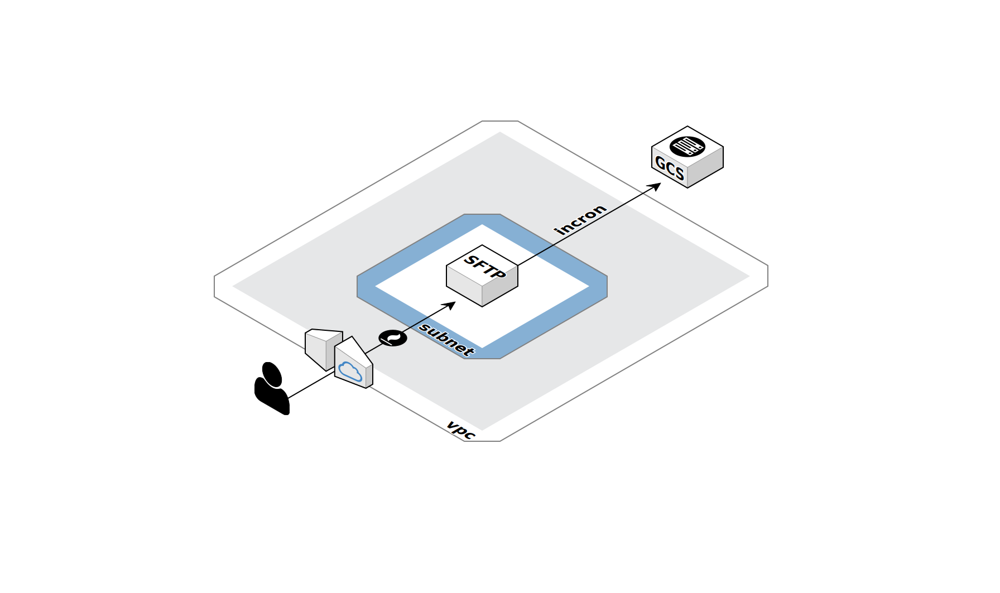

# sftp-gcloud-vm

Repository with deployment template for a GCP compute engine with sftp server. Files are automatically uploaded to the specified storage bucket. This is template which deploys a single VM with a data disk, network and serviceaccount. Use `config.yaml` to deploy this template. Before deploying, edit the config file and fill in the different parameters.

Create static IP address first and add it to config.yaml:

    gcloud compute --project "PROJECT_ID" addresses create "STATIC_IP_NAME" --region "REGION"

When ready, deploy with the following command:

    deploy.sh "PROJECT_ID" "DEPLOYMENT_NAME"

